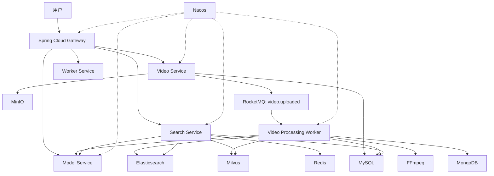

# AI 视频检索系统

AI 视频检索系统是一个基于 Spring Cloud Alibaba 的生产导向项目，目标是支持用户通过文字或图片检索视频，并返回相关视频片段、命中证据和辩证分析结果。

系统采用“在线混合召回 + 多阶段重排 + 离线深度理解”的架构：复杂的视频理解前置到离线处理，在线链路专注于轻量、快速、可解释的检索响应。

## 核心能力

- 文字搜视频、图片搜视频和混合检索。
- 返回片段级结果，包括 `videoId`、`segmentId`、`startTimeMs`、`endTimeMs`。
- 基于标题、字幕、OCR、Caption、元数据、文本向量、图片向量和片段向量进行混合召回。
- 对多路召回结果做融合、去重、聚合、重排和证据构建。
- LLM 只基于明确证据做辩证分析，避免脱离检索证据生成判断。
- 离线处理视频上传、转码、抽帧、ASR、OCR、Caption、Embedding 和索引构建。
- 支持失败重试、任务幂等、索引重建前清理旧片段、`X-Trace-Id` 链路排查。

## 技术栈

| 类型 | 技术 | 用途 |
| --- | --- | --- |
| 微服务框架 | Spring Boot 3.3.x | 服务开发基础 |
| 微服务体系 | Spring Cloud 2023.x / Spring Cloud Alibaba | 网关、注册、配置治理 |
| 网关 | Spring Cloud Gateway | 统一入口和路由 |
| 注册配置 | Nacos 2.x | 服务注册与配置中心 |
| 消息队列 | RocketMQ 5.x | 视频上传后的异步处理事件 |
| 对象存储 | MinIO | 原视频、封面、关键帧、切片文件 |
| 结构化存储 | MySQL | 视频资产、任务状态、片段、日志 |
| 半结构化存储 | MongoDB | ASR、OCR、Caption、模型原始结果 |
| 文本检索 | Elasticsearch | 关键词、字幕、OCR、Caption 召回 |
| 向量检索 | Milvus | 文本、图片、视频片段向量召回 |
| 缓存 | Redis | 搜索缓存、查询向量缓存、限流计数 |
| 视频处理 | FFmpeg | 转码、抽帧、切片、封面生成 |
| 可观测 | Prometheus / Grafana / OpenTelemetry | 指标和链路追踪 |
| 限流熔断 | Sentinel | 接口级限流、熔断、降级 |

## 模块说明

| 模块 | 默认端口 | 职责 |
| --- | --- | --- |
| `ai-search-common` | 无 | 公共 DTO、枚举、响应结构和领域契约 |
| `ai-search-gateway` | `18080` | 统一入口，路由到搜索、视频、worker、模型服务 |
| `ai-search-search-service` | `18081` | 查询理解、多路召回、融合、重排、证据和分析编排 |
| `ai-search-video-service` | `18082` | 视频上传初始化、完成确认、资产状态、上传事件发布 |
| `ai-search-worker-service` | `18083` | 离线视频索引工作流、阶段任务、产物、ES/Milvus 写入 |
| `ai-search-model-service` | `18084` | 模型网关，封装 embedding、OCR、ASR、Caption、分析能力 |

## 架构概览



在线检索链路：

```text
SearchController
  -> SearchUseCase
  -> QueryUnderstandingService
  -> HybridRecallOrchestrator
  -> CandidateMergeService
  -> RerankService
  -> EvidenceService
  -> LlmAnalysisService
```

离线索引链路：

```text
VideoUploadService
  -> RocketMqVideoProcessingEventPublisher
  -> VideoUploadedConsumer
  -> VideoIndexingWorkflowService
  -> VideoProcessingTaskExecutor
  -> StageProcessor
  -> ElasticsearchIndexWriter / MilvusVectorIndexWriter
```

## 本地环境

基础中间件复用本机 Docker Compose：

```powershell
docker compose -f E:\workspace\docker\docker-compose.yml up -d
```

默认连接：

| 组件 | 地址 |
| --- | --- |
| Nacos | `localhost:8848` |
| Redis | `localhost:6379` |
| MinIO | `localhost:9000` |
| Milvus | `localhost:19530` |
| Elasticsearch | `localhost:9200` |
| RocketMQ | `localhost:9876` |

构建与测试：

```powershell
mvn test
```

服务启动示例：

```powershell
mvn -pl ai-search-gateway spring-boot:run
mvn -pl ai-search-search-service spring-boot:run
mvn -pl ai-search-video-service spring-boot:run
mvn -pl ai-search-worker-service spring-boot:run
mvn -pl ai-search-model-service spring-boot:run
```

健康检查：

```powershell
Invoke-RestMethod http://localhost:18080/actuator/health
Invoke-RestMethod http://localhost:18081/actuator/health
Invoke-RestMethod http://localhost:18082/actuator/health
Invoke-RestMethod http://localhost:18083/actuator/health
Invoke-RestMethod http://localhost:18084/actuator/health
```

## 配置要点

模型服务 provider：

| 配置 | 说明 |
| --- | --- |
| `ai-search.models.provider=deterministic` | 默认本地确定性向量，便于开发和测试稳定 |
| `ai-search.models.provider=http` | 转发到外部 embedding 服务 |
| `ai-search.models.provider=dashscope` | 使用阿里云百炼 DashScope 兼容接口 |

DashScope 相关配置：

```yaml
ai-search:
  models:
    dashscope:
      api-key: ${DASHSCOPE_API_KEY:}
```

搜索与 worker 生产配置重点：

- `ai-search.search.elasticsearch.endpoint`
- `ai-search.search.milvus.endpoint`
- `ai-search.search.model.endpoint`
- `ai-search.worker.model.max-concurrent-calls`
- `ai-search.worker.model.qps-limit`
- `ai-search.worker.model.max-attempts`
- `ai-search.worker.model.initial-backoff-ms`
- `ai-search.worker.model.cache-max-entries`
- `ai-search.security.api-key`

配置 `ai-search.security.api-key` 后，所有 `/api/**` 请求都需要携带：

```http
X-AI-Search-Api-Key: <your-api-key>
```

## API 示例

### 搜索接口

```http
POST http://localhost:18081/api/search
Content-Type: application/json

{
  "text": "新能源车 发布会",
  "topK": 5,
  "withAnalysis": true
}
```

### 初始化视频上传

```http
POST http://localhost:18082/api/videos/uploads
Content-Type: application/json

{
  "fileName": "demo.mp4",
  "fileSize": 10485760,
  "contentType": "video/mp4",
  "title": "演示视频"
}
```

接口会生成 MinIO 预签名上传 URL，并写入 MySQL 视频资产记录。

### 完成视频上传

```http
POST http://localhost:18082/api/videos/{videoId}/complete
Content-Type: application/json

{
  "objectETag": "optional-etag",
  "fileSize": 10485760
}
```

接口会校验 MinIO 对象是否存在，更新视频状态为 `PROCESSING`，并发布 `video.uploaded` 事件。

### 片段证据与索引维护

- `GET /api/workflows/video-indexing/stages`
- `GET /api/workflows/video-indexing/videos/{videoId}/slice-plan`
- `GET /api/workflows/video-indexing/videos/{videoId}/segments/artifacts`
- `GET /api/workflows/video-indexing/videos/{videoId}/segments/{segmentId}`
- `POST /api/workflows/video-indexing/videos/{videoId}/delete-index`

## 端到端联调

目标是验证真实视频从上传到可检索的完整链路：

1. video-service 初始化上传并写入 `video_asset`。
2. MinIO 保存原始视频对象。
3. completeUpload 发布 RocketMQ 事件。
4. worker-service 执行切片、ASR、OCR、Caption、Embedding。
5. worker-service 写入 `video_segment`、`video_segment_artifact`、Elasticsearch 和 Milvus。
6. search-service 能通过文本或图片查询召回对应片段。

前置条件：

- Docker 基础环境已启动。
- `DASHSCOPE_API_KEY` 已配置到 model-service 运行环境。
- 本机可执行 `ffmpeg` 和 `ffprobe`，或通过 `ai-search.ffmpeg.command` / `ai-search.ffmpeg.ffprobe-command` 指向正确路径。
- MinIO 临时访问 URL 可被 DashScope 访问；本地 `localhost` 不能公网访问时，需要配置可访问的对象网关地址。
- 如启用 `ai-search.security.api-key`，请求需携带 `X-AI-Search-Api-Key`。

通过标准：

- `video_asset.status = READY`。
- 至少生成 1 条 `video_segment`。
- 关键片段至少具备 `ASR_TEXT`、`OCR_TEXT` 或 `CAPTION` 中的一类证据。
- 片段证据接口能返回时间范围、ASR/OCR/Caption 和 `keyFrameUrl`。
- Elasticsearch 和 Milvus 均写入片段索引。
- 搜索接口可召回对应 `segmentId`。
- 重建索引前会先清理旧 ES/Milvus 片段，避免重复残留。

## 模型选型

| 能力 | 默认模型 | 用途 |
| --- | --- | --- |
| 文本向量 | `text-embedding-v4` | 查询文本、ASR/OCR/Caption 文本向量化 |
| 图片/多模态向量 | `multimodal-embedding-v1` | 图片搜视频、关键帧向量化 |
| ASR | `paraformer-v2` | 视频语音转写 |
| OCR | `qwen-vl-ocr` | 视频帧文字识别 |
| 视觉描述 | `qwen3-vl-flash` | 关键帧 caption |
| 辩证分析 | `qwen-plus` | 汇总证据、输出正反分析 |
| 精排 | `gte-rerank-v2` | 多路召回候选 rerank |

## 开发路线

### 第一阶段：工程骨架与检索闭环

- 建立 Spring Cloud Alibaba 多模块工程。
- 提供 Gateway、Search、Video、Worker、Model 服务边界。
- 搜索服务跑通查询理解、多路召回、融合、重排、证据构建和辩证分析链路。
- 使用本地确定性能力保证接口和测试稳定。

### 第二阶段：真实中间件适配

- Video Service 接入 MinIO，创建业务 bucket。
- Video Service 接入 RocketMQ，上传完成后发送 `video.uploaded`。
- Worker Service 消费 `video.uploaded`，执行状态机。
- Search Service 接入 Redis 查询缓存。

### 第三阶段：检索引擎接入

- 接入 Elasticsearch 关键词召回。
- 接入 Milvus 文本、图片、视频片段向量召回。
- 实现 Candidate Merge 的分数归一化和来源保留。
- 建立基础评测集。

### 第四阶段：模型能力接入

- Model Service 封装阿里云百炼 / 通义千问模型调用。
- 支持文本 embedding、图片 embedding、caption、OCR、ASR、rerank。
- 接入调用缓存、限流、重试、成本统计。

### 第五阶段：生产化

- 接入 Sentinel 限流熔断。
- 接入 Prometheus、Grafana、OpenTelemetry。
- 完善异常处理、审计日志、权限过滤和租户隔离。
- 增加端到端测试与检索质量评测。

## AI 自动生成提交信息

项目通过 Husky 的 `prepare-commit-msg` hook 接入 DeepSeek，根据暂存区 diff 自动生成 Git 提交信息。

### 使用方式

1. 配置本机环境变量 `DEEPSEEK_API_KEY`。
2. 暂存需要提交的文件。
3. IDEA 提交面板中保留提交信息框里的 `__AI_COMMIT_MESSAGE__` 不变。
4. 点击提交后，hook 会调用 DeepSeek，将占位符替换为真实提交信息。

行为规则：

- 保留 `__AI_COMMIT_MESSAGE__`：自动生成提交信息。
- 手动输入提交信息：保留用户手写内容，不覆盖。
- 清空提交信息：IDEA 可能在 Git hook 执行前拦截，因此不建议清空。

### 配置流程

安装依赖并启用 Husky：

```powershell
npm install
npm run prepare
```

设置本仓库提交模板：

```powershell
git config commit.template .gitmessage
```

确认配置：

```powershell
git config --show-origin --get core.hooksPath
git config --show-origin --get commit.template
```

期望输出包含：

```text
.husky
.gitmessage
```

配置环境变量：

```powershell
[Environment]::SetEnvironmentVariable("DEEPSEEK_API_KEY", "<your-deepseek-api-key>", "User")
```

重新打开 IDEA 或终端，让新环境变量生效。

### 验证方式

运行 hook 验证脚本：

```powershell
D:\software\work\git\Git\bin\bash.exe scripts/test-ai-commit-hook.sh
```

手动验证：

```powershell
git add ai-commit-hook-manual-test.txt
git commit
```

如果使用 IDEA：

1. 打开 Commit 面板。
2. 确认提交信息框中有 `__AI_COMMIT_MESSAGE__`。
3. 不修改该占位符，直接提交。
4. 真实提交时 hook 会生成类似 `docs(readme): 更新项目文档` 的提交信息。

### 故障排查

- 如果 IDEA 提示 `Specify commit message`，说明提交模板没有加载；执行 `git config commit.template .gitmessage` 后重新打开 Commit 面板。
- 如果提示未设置 `DEEPSEEK_API_KEY`，确认用户级或机器级环境变量已配置，并重启 IDEA。
- 如果提示未找到 Python，确认 Git Bash 环境可执行 `python` 或 `python3`。
- 如果没有 staged diff，hook 会跳过生成；需要先暂存文件。

## 当前实现边界

当前项目已经具备可编译、可测试、可继续演进的微服务骨架和核心垂直链路。

已完成：

- 多模块 Maven 工程。
- Gateway、Search、Video、Worker、Model 服务入口。
- 搜索主链路内部编排。
- 视频上传初始化与完成确认。
- RocketMQ 上传事件发布与消费。
- Worker 阶段任务、产物、失败重试和索引写入边界。
- Elasticsearch 与 Milvus REST 适配器。
- 模型服务 deterministic/http/dashscope provider。
- API Key 鉴权、`X-Trace-Id` 透传、基础指标。

待继续完善：

- 真实 FFmpeg 转码/抽帧处理器。
- 真实 ASR、OCR、Caption、Embedding 阶段处理器。
- Redis 搜索缓存和查询向量缓存。
- Sentinel 限流规则。
- OpenTelemetry 链路追踪。
- 检索质量评测集。
