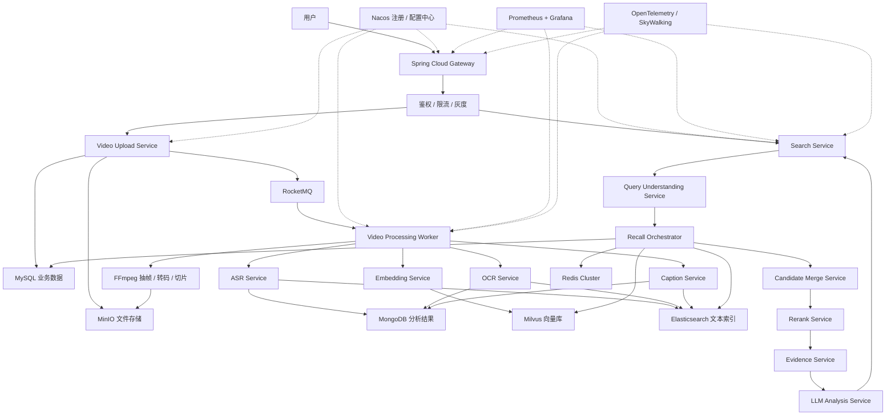
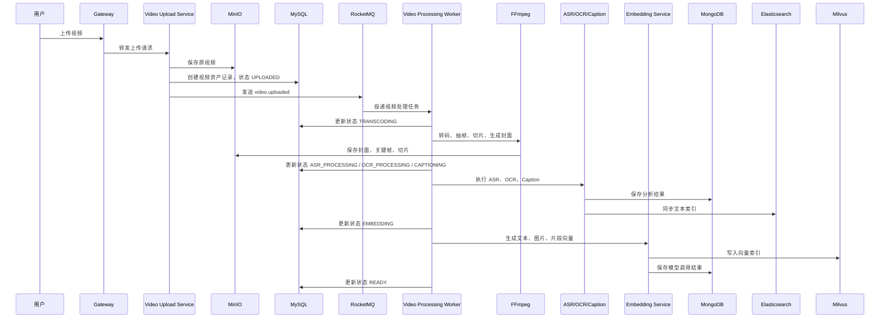
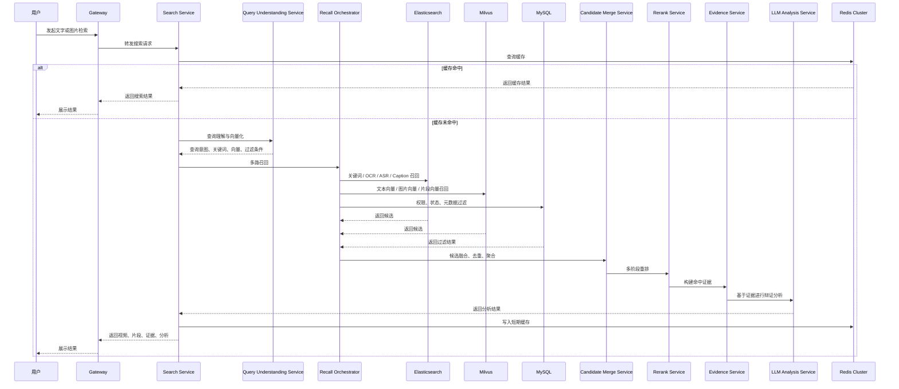

### 项目定位
- 项目名称：AI 视频检索系统
- 核心能力：用户可以通过文字或图片检索视频，并返回相关视频、命中片段、命中证据和辩证分析结果。
- 架构选择：以“候选方案二：混合召回 + 多阶段重排架构”为主体，吸收“候选方案三：离线深度理解 + 在线高速检索架构”的离线处理思想。
- 设计目标：在召回率、准确率、响应速度和成本之间取得平衡，避免只依赖单一向量检索或单一大模型分析。

### 架构规范
- 微服务架构：Spring Cloud Alibaba
- 网关：Spring Cloud Gateway
- 注册中心：Nacos 2.x
- 配置中心：Nacos Config
- 消息队列：RocketMQ
- 缓存：Redis Cluster
- 文件存储：MinIO
- 向量存储：Milvus
- 半结构化分析结果存储：MongoDB
- 结构化业务数据存储：MySQL
- 文本检索与关键词召回：Elasticsearch
- 监控：Prometheus + Grafana
- 链路追踪：OpenTelemetry 或 SkyWalking
- 限流熔断：Sentinel
- 视频处理：FFmpeg

### 模型与 AI 能力要求
- 模型优先选择国内模型，例如阿里云百炼、通义千问、多模态 Embedding、国内 Rerank 模型等。
- 文本查询需要生成文本向量，并结合 Elasticsearch 关键词检索。
- 图片查询需要生成图片向量，同时可以补充图片 caption、OCR 或主体识别结果。
- 视频入库后需要离线生成视频片段、关键帧、字幕、OCR、caption、摘要和向量索引。
- 大模型不直接承担核心召回职责，主要负责搜索结果解释、证据总结和辩证分析。

### 核心设计原则
- 在线检索链路必须轻量，复杂的视频理解尽量前置到离线处理阶段。
- 检索不能只依赖 Milvus，必须结合 Elasticsearch、Milvus、MySQL 元数据和 Redis 缓存。
- 搜索结果不能只返回整个视频，必须尽可能返回命中的片段时间范围。
- 所有模型调用结果需要缓存或持久化，避免同一视频、图片、文本重复计算。
- 多路召回结果必须进行融合、去重、聚合和重排。
- LLM 分析必须基于明确证据，输出正向证据、反向证据、不确定性和结论，避免无依据生成。
- 系统需要预留检索效果评测能力，用于评估召回率、准确率、响应速度和成本。

### 服务模块设计

#### 接入层
- Gateway Service
  - 基于 Spring Cloud Gateway。
  - 负责统一入口、鉴权、路由、限流、跨域、灰度发布。
  - 接入 Sentinel，对搜索、上传、图片检索、LLM 分析接口分别配置限流策略。

#### 业务服务层
- Video Upload Service
  - 负责视频上传、分片上传、上传完成回调。
  - 视频、封面、关键帧、切片文件统一存储到 MinIO。
  - 上传完成后写入 MySQL，并发送 RocketMQ 消息 `video.uploaded`。

- Video Asset Service
  - 负责视频资产、片段、帧、标签、权限、状态管理。
  - MySQL 存储强一致业务数据。
  - MongoDB 存储视频分析结果、片段分析结果、OCR/ASR/caption 等半结构化数据。

- Search Service
  - 对外提供文字搜视频、图片搜视频、混合检索接口。
  - 负责编排查询理解、多路召回、候选融合、重排、证据构建和结果返回。

- Query Understanding Service
  - 识别查询类型：纯文本、图片、文本 + 图片。
  - 文本查询：分词、实体识别、同义词扩展、查询改写。
  - 图片查询：图片向量化、图片 caption、OCR、主体识别。

- Recall Orchestrator
  - 统一编排多路召回，避免召回逻辑散落在业务代码中。
  - 召回通道包括 Elasticsearch 关键词召回、Milvus 文本向量召回、Milvus 图片向量召回、Milvus 视频片段向量召回、OCR/ASR 召回、元数据过滤召回。

- Candidate Merge Service
  - 对多路召回结果进行去重、聚合、分数归一化和来源保留。
  - 同一视频多个片段命中时，需要同时保留片段级结果和视频级聚合结果。

- Rerank Service
  - 第一阶段使用规则重排，综合向量相似度、BM25 分数、OCR/ASR 命中、发布时间、热度和权限。
  - 第二阶段接入国内 Rerank 模型，对 TopN 候选进行精排。

- Evidence Service
  - 构建每条结果的命中证据。
  - 证据包括视觉相似度、字幕命中、OCR 命中、标题/标签命中、片段时间范围、召回来源。

- LLM Analysis Service
  - 基于 Evidence Service 输出的证据进行辩证分析。
  - 输出内容包括相关依据、可能误判点、不确定性、适用场景和结论。
  - 不允许脱离检索证据直接生成判断。

#### AI 能力层
- Model Gateway
  - 统一封装国内模型供应商调用。
  - 负责 API Key 管理、模型路由、限流、重试、降级、调用日志和成本统计。

- Embedding Service
  - 负责文本、图片、视频片段向量生成。
  - 结果写入 Milvus，并将模型调用记录写入 MySQL 或 MongoDB。

- OCR Service
  - 识别关键帧中的文字。
  - OCR 结果写入 MongoDB，并同步到 Elasticsearch 参与关键词召回。

- ASR Service
  - 提取视频语音字幕。
  - ASR 文本写入 MongoDB，并同步到 Elasticsearch 和 Milvus。

- Caption Service
  - 为关键帧或视频片段生成视觉描述。
  - Caption 文本写入 MongoDB，并进入 Elasticsearch 与 Milvus。

#### 离线处理层
- Video Processing Worker
  - 消费 RocketMQ 视频处理消息。
  - 使用 FFmpeg 完成视频元信息提取、转码、抽帧、封面生成、片段切分。

- Indexing Worker
  - 负责将视频分析结果写入 Elasticsearch 和 Milvus。
  - 必须支持幂等、失败重试和补偿。

- Workflow State Machine
  - 管理视频处理状态。
  - 建议状态：UPLOADED、TRANSCODING、FRAME_EXTRACTING、ASR_PROCESSING、OCR_PROCESSING、CAPTIONING、EMBEDDING、INDEXING、READY、FAILED。

### 数据存储设计
- MinIO
  - 存储原视频、转码视频、封面图、关键帧图、视频切片。

- MySQL
  - 存储用户、视频资产、视频片段、任务状态、权限、模型调用记录、搜索日志。

- MongoDB
  - 存储视频分析结果、关键帧分析结果、OCR 文本、ASR 字幕、caption、模型原始响应。

- Elasticsearch
  - 存储标题、描述、标签、字幕、OCR、caption、摘要等可检索文本。
  - 负责关键词召回、短语匹配、实体词精确匹配。

- Milvus
  - 存储文本向量、图片向量、视频片段向量。
  - 支持文字搜视频、图片搜视频、相似片段检索和语义召回。

- Redis Cluster
  - 缓存热门搜索结果、查询向量、视频元数据、搜索会话、限流计数。

### 推荐 Milvus Collection
- video_frame_vector
  - frame_id
  - video_id
  - segment_id
  - timestamp
  - image_vector
  - tenant_id

- video_segment_vector
  - segment_id
  - video_id
  - start_time
  - end_time
  - multimodal_vector
  - tenant_id

- video_text_vector
  - text_id
  - video_id
  - segment_id
  - text_vector
  - text_type: title/subtitle/ocr/asr/caption/summary
  - tenant_id

### 架构图

### 视频入库与离线索引时序图

### 在线文字 / 图片检索时序图

### 质量与性能目标
- 文字检索：不含 LLM 分析时，P95 建议控制在 800ms 内。
- 图片检索：不含 LLM 分析时，P95 建议控制在 1500ms 内。
- 带 LLM 辩证分析：建议前端流式返回，P95 目标 3s-8s。
- 离线入库：允许存在索引延迟，但必须可查看处理状态和失败原因。
- 检索评测集：必须覆盖文字搜视频、图片搜视频、字幕命中、OCR 命中、相似视频检索。

### 辩证取舍
- 向量检索提升语义召回，但对专业词、品牌、人名、型号不如 Elasticsearch 稳定，因此必须混合召回。
- 离线深度理解会增加入库延迟，但可以显著降低在线搜索耗时和模型成本。
- LLM 能提升解释能力，但不适合作为核心检索引擎，应放在证据分析阶段。
- MinIO 降低文件存储复杂度和成本，但生产部署需要考虑副本、备份、生命周期管理和对象访问权限。
- 多阶段重排能提升准确率，但会增加响应时间，因此应只对 TopN 候选执行精排。
